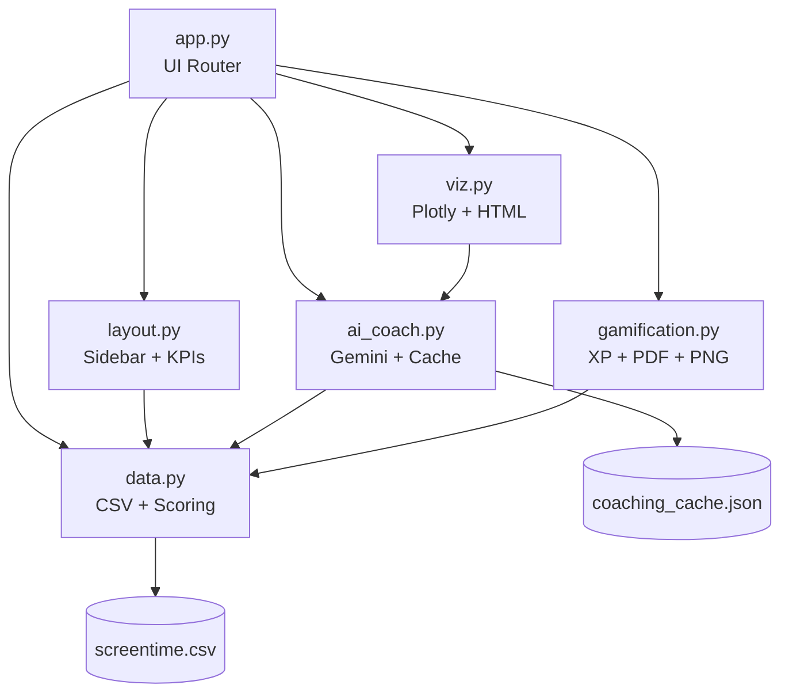

# 🧠 Life-OS — Productivity Command Center

[](https://streamlit.io)
[](https://ai.google.dev)
[](https://python.org)
[](https://mirai-summer-internship.onrender.com)
[](LICENSE)

> **Brutally Honest. Beautifully Designed.**  
> A Streamlit dashboard that transforms 14 days of screen-time data into an AI-powered accountability system — with gamification, coaching, and zero-API-waste architecture.

---

## 🎥 Demo Video

> _[Add your demo video link or embed here]_

---

## ✨ Features

| Category | Features |
|---|---|
| **Dashboard** | KPI row (total time, top app, delta vs goal + vs yesterday), 14-day trend chart, Life Score gauge (with yesterday delta), Compare Two Days |
| **AI Coaching** | Gemini 2.0 Flash with `system_instruction` + user-prompt split, function calling (`get_real_world_equivalent`), 3 coach personalities, JSON response caching |
| **Voice Journal** | `st.audio_input` voice recording → Google Speech-to-Text transcription → folds into Gemini prompt as context |
| **Gamification** | Streak & XP system, 8 unlockable Achievement Badges, full-month GitHub-style heatmap |
| **Insights** | What-If Time Machine, Real-World Equivalents (gauge bars), Digital Diet Pyramid, App-Flow Sankey |
| **Shareables** | Weekly Roast PDF (fpdf2), Life-OS Wrapped PNG (matplotlib), Accountability Link |
| **UX Polish** | Dynamic background (green/amber/red per severity), `st.data_editor` for daily log edits, collapsible expanders, `st.form` batching |
| **Reliability** | Live AI / Cached / Offline status badge, graceful fallback on any API error, try/except on all I/O |

---

## 📸 Screenshots

<!-- Add dashboard screenshot here -->


<!-- Add coaching response screenshot here -->


<!-- Add PDF export screenshot here -->


---

## 🎥 Demo Video

<!-- Add a working demo video here (e.g. a GitHub-hosted mp4, or a Loom/YouTube link)
     showing the full app flow: dashboard load, coaching request, voice journal, PDF export -->

---

## 🚀 Quick Start

```bash
# 1. Clone and enter the project
git clone <repo-url>
cd life-os

# 2. Install dependencies
pip install -r requirements.txt

# 3. Configure your API key
cp .env.example .env
# Edit .env and set: GEMINI_API_KEY=your_actual_key_here

# 4. Run
streamlit run app.py

# Expected output:
#   You can now view your Streamlit app in your browser.
#   Local URL:    http://localhost:8501
#   Network URL:  http://192.168.x.x:8501
```

Open **http://localhost:8501** in your browser.

---

## 📁 Architecture

```
life-os/
├── app.py               # Thin Streamlit UI router — imports from all modules
├── layout.py            # Reusable sidebar + KPI row renderers
├── data.py              # CSV loading, pandas aggregation, scoring
├── ai_coach.py          # Gemini API, function calling, caching, offline fallback
├── viz.py               # Plotly figure builders + HTML gauge bars
├── gamification.py      # XP/streak, badges, PDF report, Wrapped PNG card
├── screentime.csv       # 14-day screen time dataset
├── coaching_cache.json  # AI response cache (created at runtime)
├── screenshots/         # Drop your screenshots here (.gitkeep included)
├── requirements.txt     # Python dependencies
├── .env.example         # API key placeholder
├── .gitignore           # Keeps .env out of version control
└── README.md            # You are here
```

### Module Responsibilities



---

## 🤖 AI Integration Strategy

Life-OS uses Gemini 2.0 Flash with a **3-layer defense** against quota exhaustion:

1. **Cached responses** — Each request is hashed (date + category data + personality + voice note). Identical re-requests never hit the API.
2. **On-demand only** — The API is called exclusively via a `st.form` submit button — never on page load or widget change.
3. **Offline fallback** — If the API is unavailable (missing key, quota exceeded, network error), rule-based templates activate silently.

### Advanced: Gemini Function Calling

`ai_coach.py` exposes `get_real_world_equivalent(minutes)` as a Gemini Tool. When Gemini calls this tool, the app:
1. Executes the local Python function
2. Feeds the result back to Gemini for a richer, data-grounded response

### Advanced: `system_instruction` Split

The prompt is split into:
- **`system_instruction`** — personality persona + behavioral rules (static per coach selection)
- **`user_prompt`** — actual screen time data + optional voice journal transcript (dynamic per day)

This matches Gemini API best practices and improves response consistency.

---

## 🎙️ Voice Journal (Innovation Deliverable)

Record a short audio note explaining why you were on your phone. The transcript is:
- Generated via Google Speech Recognition (offline, no extra API key)
- Folded into the Gemini prompt as extra context
- Factored into the cache key — so a new recording = new AI response

> **Requires:** Streamlit ≥ 1.37 (for `st.audio_input`) + `SpeechRecognition` package

---

## ☁️ Streamlit Cloud Deployment

1. Push repo to GitHub (`.env` is gitignored by default)
2. Go to [share.streamlit.io](https://share.streamlit.io) → Connect repo → Select `app.py`
3. Under **Secrets**, add:
   ```toml
   GEMINI_API_KEY = "your_actual_key_here"
   ```
4. Click **Deploy**

> [!WARNING]
> **Ephemeral cache on Render free tier:** `coaching_cache.json` is stored on Render's local
> filesystem, which resets on every service restart or redeploy. This doesn't break
> functionality — cached responses simply regenerate on the next coaching request.
> To persist the cache across deploys, commit `coaching_cache.json` to your repo,
> or switch to a persistent store (e.g. Redis, Streamlit Cloud Secrets).

---

## 🔒 Quota Safety

Gemini free tier can be as low as 5 RPM / 20 RPD. Life-OS is architected for this:

- API called **only on button click** — never automatically
- Same-day + same-data + same-personality responses are **cached indefinitely**
- Voice journal hash means recording a different note will hit the API once — and cache forever after
- All errors fall through to **offline templates** — the app never crashes

---

## 🔮 Future Scope

| Feature | Description |
|---|---|
| Multi-user mode | Per-user cache keyed by session ID |
| CSV upload | Let users upload their own screen time exports |
| Weekly trend email | Scheduled Gemini summary via Gmail API |
| Streak sharing | Shareable streak card via query params |
| Mobile PWA | Streamlit + PWA manifest for phone install |

---

## 📄 License

MIT — hack freely, stay accountable.

---

*Built for the Mirai School of Technology Summer Internship Capstone — Assignment 7*