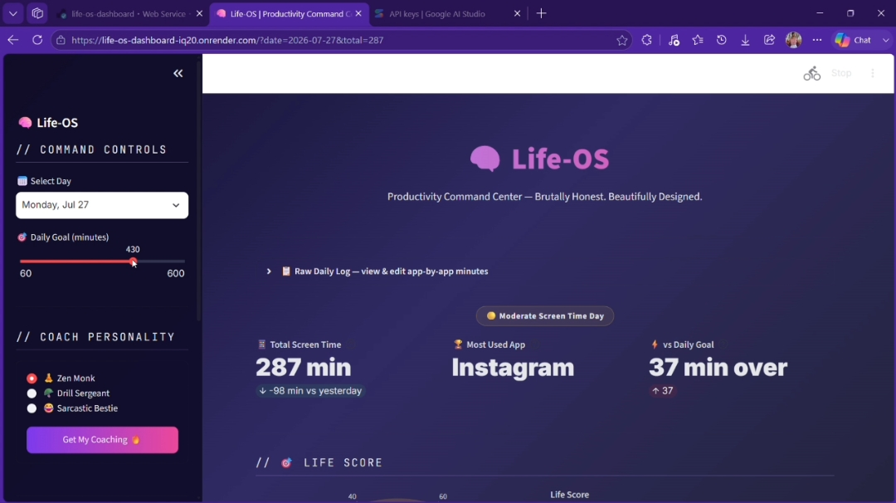
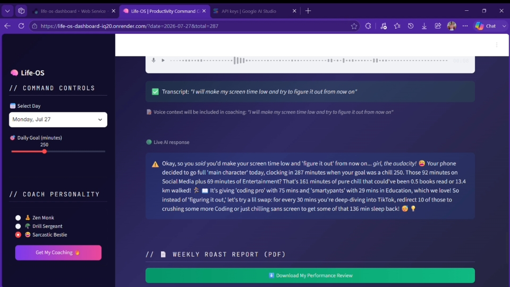
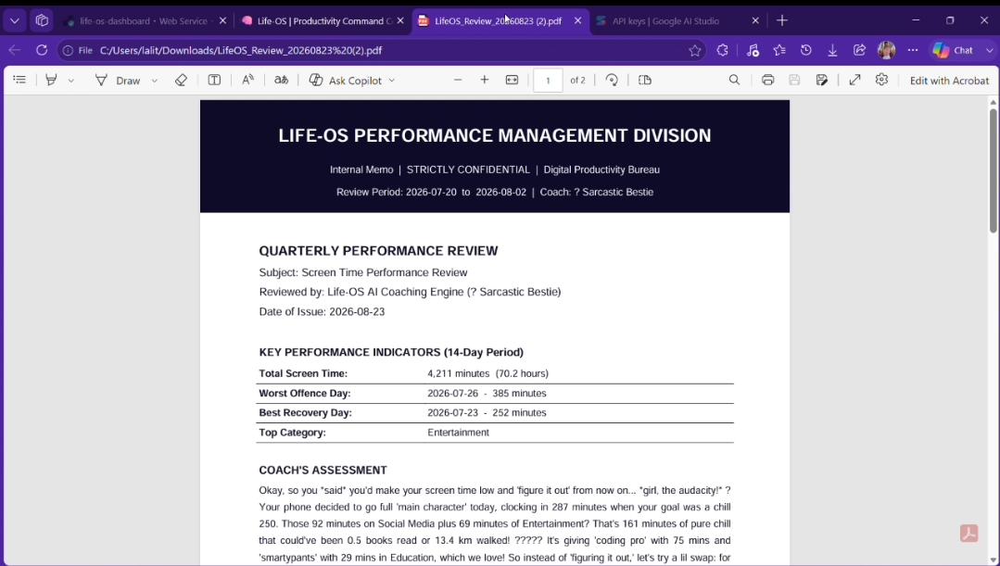
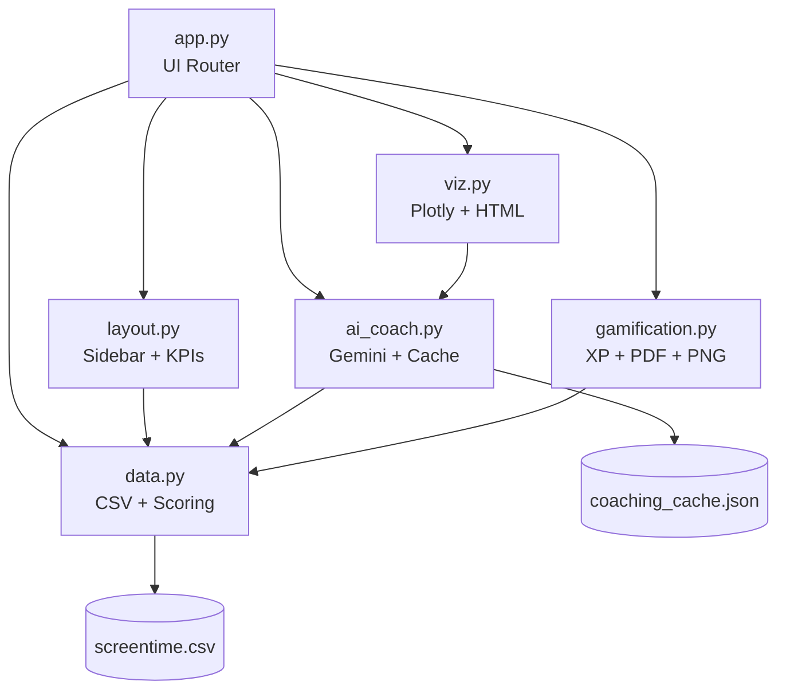

<div align="center">

```
██╗     ██╗███████╗███████╗       ██████╗ ███████╗
██║     ██║██╔════╝██╔════╝      ██╔═══██╗██╔════╝
██║     ██║█████╗  █████╗  █████╗██║   ██║███████╗
██║     ██║██╔══╝  ██╔══╝  ╚════╝██║   ██║╚════██║
███████╗██║██║     ███████╗      ╚██████╔╝███████║
╚══════╝╚═╝╚═╝     ╚══════╝       ╚═════╝ ╚══════╝

P R O D U C T I V I T Y   C O M M A N D   C E N T E R
an AI accountability coach for your screen time
```

[](https://streamlit.io)
[](https://ai.google.dev)
[](https://python.org)
[](https://life-os-dashboard-iq20.onrender.com)
[](LICENSE)

**`Brutally Honest.`** **`Beautifully Designed.`** **`Zero API Waste.`**

</div>

---

```console
shruti@mirai:~$ whoami life-os
> A Streamlit dashboard that turns 14 days of screen-time data into an
> AI-powered accountability system — gamified, cached, and built to
> survive a 5-requests-per-minute free-tier quota without ever crashing.
```

<div align="center">

### 🚀 [**LAUNCH LIVE APP →**](https://life-os-dashboard-iq20.onrender.com)

`https://life-os-dashboard-iq20.onrender.com`

> ⚠ Hosted on Render's free tier — the service sleeps when idle.
> First load after inactivity may take **10–30 seconds** to spin up. This is expected, not a bug.

</div>

---

## 📼 Demo

https://github.com/user-attachments/assets/c763d346-7a25-454a-ba85-7b451ee1d088

---

## `$ cat features.log`

| Module | Capabilities |
|---|---|
| **📊 Dashboard** | KPI row (total time · top app · delta vs goal · delta vs yesterday), 14-day trend chart, Life Score gauge with yesterday delta, Compare-Two-Days mode |
| **🤖 AI Coaching** | Gemini 2.0 Flash · `system_instruction` + user-prompt split · function calling (`get_real_world_equivalent`) · 3 selectable coach personalities · JSON response caching |
| **🎙 Voice Journal** | `st.audio_input` recording → Google Speech-to-Text → transcript folded into the Gemini prompt as context |
| **🏆 Gamification** | Streak & XP system, 8 unlockable achievement badges, GitHub-style monthly heatmap |
| **🔍 Insights** | What-If Time Machine, Real-World Equivalents (gauge bars), Digital Diet Pyramid, App-Flow Sankey diagram |
| **📤 Shareables** | Weekly Roast PDF (`fpdf2`), Life-OS Wrapped PNG (`matplotlib`), accountability link |
| **✨ UX Polish** | Severity-reactive background (green/amber/red), `st.data_editor` inline log edits, collapsible expanders, `st.form` batched submits |
| **🛡 Reliability** | Live AI / Cached / Offline status badge — every API call is wrapped in `try/except` with a silent rule-based fallback |

---

## 📸 Screenshots

<table>
<tr>
<td width="33%">

**Dashboard**

Screen time, Life Score, daily trends, and top apps at a glance.

</td>
<td width="33%">

**AI Coaching**

Gemini reads the day's data and delivers a personalized, actionable verdict.

</td>
<td width="33%">

**Weekly Roast PDF**

Downloadable weekly report — insights, achievements, and what to fix.

</td>
</tr>
</table>

---

## `$ ./quickstart.sh`

```bash
# 1 — clone and enter
git clone <repo-url>
cd life-os

# 2 — install dependencies
pip install -r requirements.txt

# 3 — configure your API key
cp .env.example .env
# edit .env → GEMINI_API_KEY=your_actual_key_here

# 4 — run
streamlit run app.py
```

```console
  You can now view your Streamlit app in your browser.

  Local URL:    http://localhost:8501
  Network URL:  http://192.168.x.x:8501
```

No key? No problem — the app boots straight into **offline mode** with rule-based coaching templates.

---

## `$ tree life-os/`

```
life-os/
├── app.py               # Thin Streamlit UI router — imports from all modules
├── layout.py             # Sidebar + KPI row renderers
├── data.py                # CSV loading, pandas aggregation, scoring
├── ai_coach.py            # Gemini API, function calling, caching, offline fallback
├── viz.py                  # Plotly figure builders + HTML gauge bars
├── gamification.py        # XP/streak engine, badges, PDF report, Wrapped PNG card
├── screentime.csv          # 14-day synthetic screen time dataset
├── coaching_cache.json     # AI response cache (generated at runtime)
├── screenshots/             # App screenshots
├── requirements.txt         # Python dependencies
├── .env.example              # API key placeholder
├── .gitignore                 # Keeps .env out of version control
└── README.md                   # You are here
```

### Module dependency graph



---

## `$ man ai_coach`

Life-OS runs Gemini 2.0 Flash behind a **3-layer defense** against quota exhaustion (free tier: as low as 5 RPM / 20 RPD):

```
LAYER 1 — CACHE FIRST
  Each request is hashed on (date, category data, personality, voice note).
  An identical request never touches the network twice.

LAYER 2 — ON-DEMAND ONLY
  The API fires exclusively on an explicit st.form submit.
  Never on page load. Never on a widget re-render.

LAYER 3 — OFFLINE FALLBACK
  Missing key / quota hit / network drop → rule-based templates
  activate silently. The app never shows a stack trace to the user.
```

**Function calling** — `ai_coach.py` exposes `get_real_world_equivalent(minutes)` as a Gemini Tool. When Gemini invokes it, the local Python function executes and the result is fed back for a grounded, data-accurate response.

**Prompt architecture** — split into a static `system_instruction` (persona + behavioral rules per coach) and a dynamic `user_prompt` (the day's data + optional voice transcript), matching Gemini API best practice for response consistency.

---

## `$ ./record_journal.sh` — Voice Journal *(Innovation Deliverable)*

Record a short note on *why* you were on your phone. It's:

- Transcribed via Google Speech Recognition — **offline, no extra API key**
- Folded into the Gemini prompt as additional context
- Included in the cache-key hash, so a new recording triggers exactly one fresh AI call

> Requires Streamlit ≥ 1.37 (for `st.audio_input`) + the `SpeechRecognition` package.

---

## `$ deploy --target=cloud`

**Streamlit Community Cloud**

```
1. Push to GitHub (.env is gitignored by default)
2. share.streamlit.io → Connect repo → Select app.py
3. Settings → Secrets:
       GEMINI_API_KEY = "your_actual_key_here"
4. Deploy
```

**Render** *(current live deployment)*

```
1. New → Web Service → connect this repo
2. Root Directory:   Capstone Project
3. Build Command:    pip install -r requirements.txt
4. Start Command:    streamlit run app.py --server.port $PORT --server.address 0.0.0.0
5. Environment → Add Variable:
       GEMINI_API_KEY = your_actual_key_here
```

> ⚠ **Ephemeral cache on Render's free tier** — `coaching_cache.json` lives on local disk, which
> resets on every restart/redeploy. Nothing breaks; cached responses just regenerate on the next
> coaching request. For persistence across deploys, commit the cache file to the repo or move to
> a persistent store (Redis, Streamlit Cloud Secrets, etc.).

---

## `$ grep -r "quota" .`

```
✓ API called ONLY on button click — never automatic
✓ Same-day + same-data + same-personality → cached indefinitely
✓ New voice note → exactly one fresh API call, then cached forever
✓ Every failure path → offline templates, zero crashes
```

---

## `$ roadmap --next`

| Feature | Description |
|---|---|
| Multi-user mode | Per-user cache keyed by session ID |
| CSV upload | Let users bring their own screen-time export |
| Weekly trend email | Scheduled Gemini summary via Gmail API |
| Streak sharing | Shareable streak card via query params |
| Mobile PWA | Streamlit + PWA manifest for phone install |

---

<div align="center">

```console
shruti@mirai:~$ echo $LICENSE
MIT — hack freely, stay accountable.
```

*Built for the Mirai School of Technology Summer Internship — Capstone Project*

</div>
